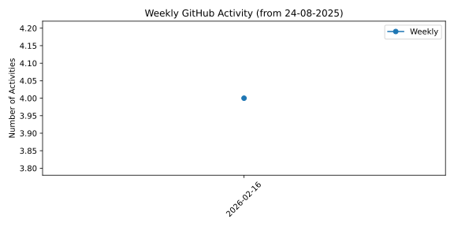
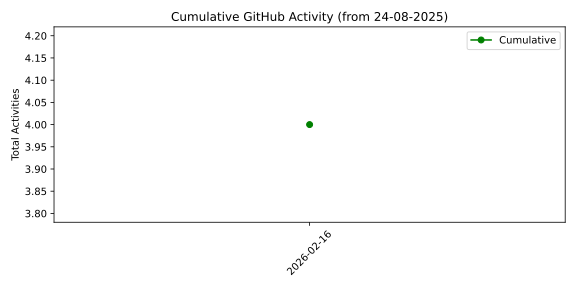

## Hi there 👋

<!--
**ppankaj321/ppankaj321** is a ✨ _special_ ✨ repository because its `README.md` (this file) appears on your GitHub profile.

Here are some ideas to get you started:

- 🔭 I’m currently working on ...
- 🌱 I’m currently learning ...
- 👯 I’m looking to collaborate on ...
- 🤔 I’m looking for help with ...
- 💬 Ask me about ...
- 📫 How to reach me: ...
- 😄 Pronouns: ...
- ⚡ Fun fact: ...
-->

# 👋 Hi, I'm Pankaj Pathak

🚀 IT professional with extensive experience in **Python, C/C++, Data Science, AI on IoT, and large-scale system design**.  
I enjoy solving complex real-time problems and building scalable, production-grade solutions.

---

## 🗓 Weekly Activity (from 24-08-2025)

<!--START_SECTION:weekly_activity-->

| Week       |   Activities |   Cumulative |
|:-----------|-------------:|-------------:|
| 2025-09-29 |            6 |            6 |
| 2025-10-06 |           31 |           37 |

<!--END_SECTION:weekly_activity-->

---

## 📊 Weekly & Cumulative Activity Graphs

**Weekly Activities**

**Cumulative Activities**

---

## 📈 GitHub Stats

---

